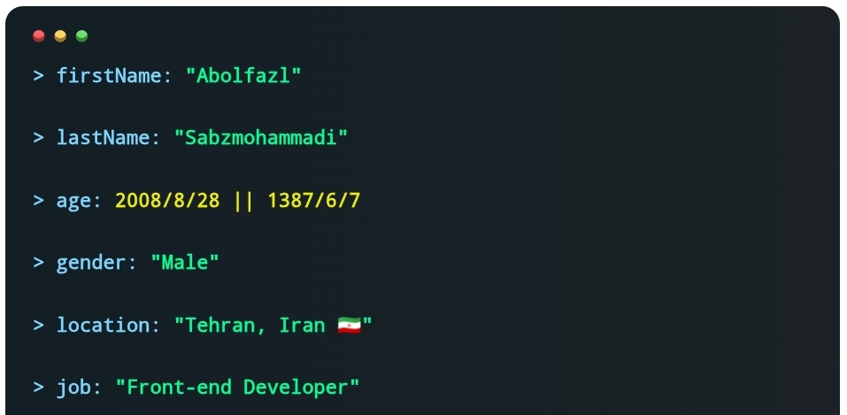
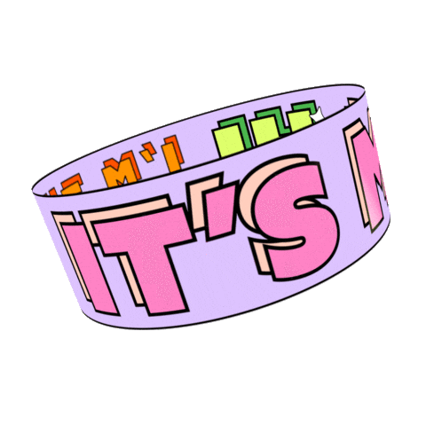
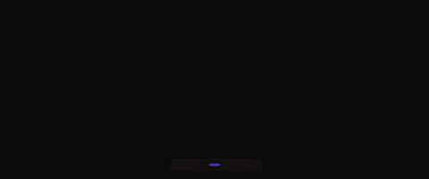
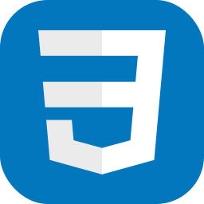
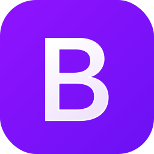
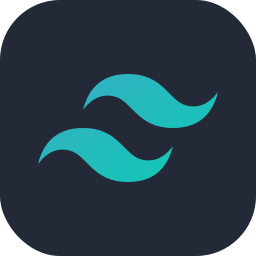
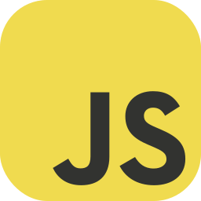
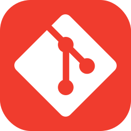
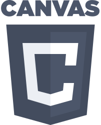
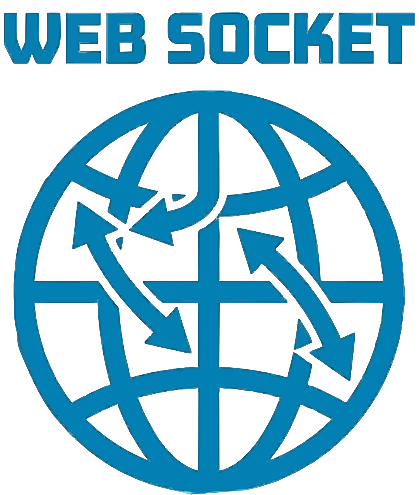

  <h1> Hey there, I'm Abolfazl
  </h1>
  

    
    
    
    
    
    
    
  

  
   
  

   Abolfazl; lastName => Sabzmohammadi; age => 2008/8/28 || 1387/6/7; gender => Male; location => Tehran, Iran🇮🇷; job => front-end Developer" />

  <h2 align="left" id="about-me"> <i>About Me</i></h2>
  I'm a creative and energetic <b>web developer</b>
   from Iran🇮🇷.
   
   

  - I have been working in this field for <b>over 1 year</b>! 💻
  - <b>I work as a front-end developer</b>, focusing on building client-side web applications using modern libraries like <b>React.js</b>. 🔭
   
  - And in my opinion:
   
  🕊️
  <i
    >“A good piece of code is like a poem — written with logic, performed with
    emotion.”</i
  >
   
   
  
   
   
   

  <h2 align="left" id="skills"> <i>My Skills</i></h2>
   

  > |&nbsp;&nbsp;&nbsp;<i>HTML</i>&nbsp;&nbsp;&nbsp;|&nbsp;&nbsp;&nbsp;&nbsp;&nbsp;<i>CSS</i>&nbsp;&nbsp;&nbsp;&nbsp;&nbsp;|<i>Bootstrap</i>|&nbsp;&nbsp;<i>Tailwind</i>&nbsp;|&nbsp;&nbsp;&nbsp;&nbsp;&nbsp;&nbsp;&nbsp;<i>JS</i>&nbsp;&nbsp;&nbsp;&nbsp;&nbsp;&nbsp;|&nbsp;&nbsp;&nbsp;&nbsp;<i>React</i>&nbsp;&nbsp;&nbsp;&nbsp;|&nbsp;&nbsp;&nbsp;&nbsp;&nbsp;&nbsp;<i>Git</i>&nbsp;&nbsp;&nbsp;&nbsp;&nbsp;&nbsp;|
> |:---------------------:|:---------------------:|:---------:|:--------------:|:--------------------:|:-----------------:|:---------------------:|
> | |  |  |  |  |  |  |

 

  > |&nbsp;&nbsp;<i>Canvas</i>&nbsp;&nbsp;|<i>WebSocket</i>|
> |:--:|:-------:|
> || |

   
   
  

  

    <h2 align="left" id="stats"> <i>My GitHub Stats</h2>
     
    <picture align="center">
      <source media="(prefers-color-scheme: dark)" srcset="https://next.ossinsight.io/widgets/official/compose-user-dashboard-stats/thumbnail.png?user_id=242604396&image_size=auto&color_scheme=dark" width="771" height="auto" />
      
    </picture>
  

