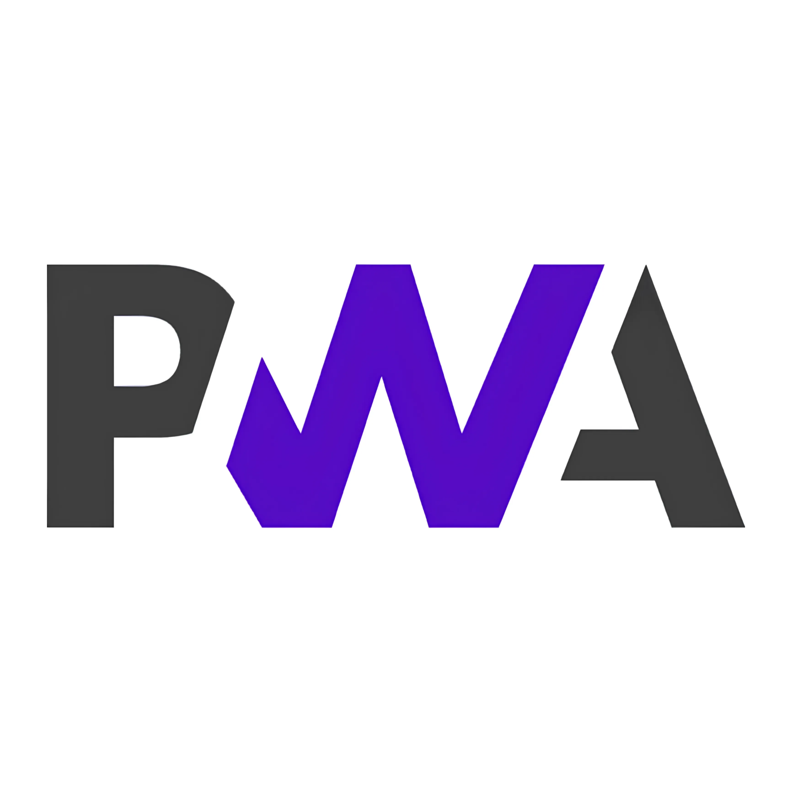
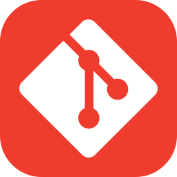

  <!-- Header -->
  

    
    
    

        
        
        
        
        
        <!--  -->
        
    

  

  

  <!-- Skills -->
  

    <h2><i>Skills</i></h2>
    

      
      
       
      
      
      <!--  
       -->
       
      
        
      
      
        
      
      
      
        
      
      
    

  

 

  <!-- Stats -->
  
  

    <picture>
    <source media="(prefers-color-scheme: dark)" srcset="https://next.ossinsight.io/widgets/official/compose-user-dashboard-stats/thumbnail.png?user_id=242604396&image_size=auto&color_scheme=dark" width="771" height="auto">
    
  </picture>
  

